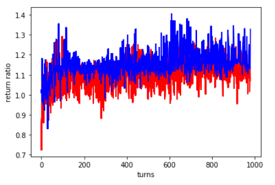

# Dueling-DQN-for-trading

使用Dueling-DQN製作自動交易AI來買賣TW0050，輸入交易日前的各類技術指標sigmoid2, bias, acc, rsv(計算方式在Data.ipynb內)，輸出三種動作，將全部資金買入、將所有股票賣出、不作為。再考慮手續費下計算總資產增加倍率。

上圖為訓練結果，以2019年作為訓練集，Y軸為每一回訓練的總資產增加倍率，X軸為訓練回合，紅線為AI訓練時加入隨機行為的訓練結果，一般來說加入隨機行為能使機器探索更多未知情形，藍線則為AI不加入隨機行為後的結果。可看出兩者隨著訓練回合上升到達飽和。

上圖為902回訓練結果，橘線對應右側Y軸，若Y為1時代表持有股票，0為賣出不持有股票。可看出機器並不存在一直持有，或者一直不持有情形。大部分的購買結果都獲利，交易頻率不高。
最後使用訓練完的AI，以2020做為測試集，進行測試。

從上圖2020的測試結果，可看出雖然無法避開疫情的衝擊，但在之後交易中仍有持續獲利。

